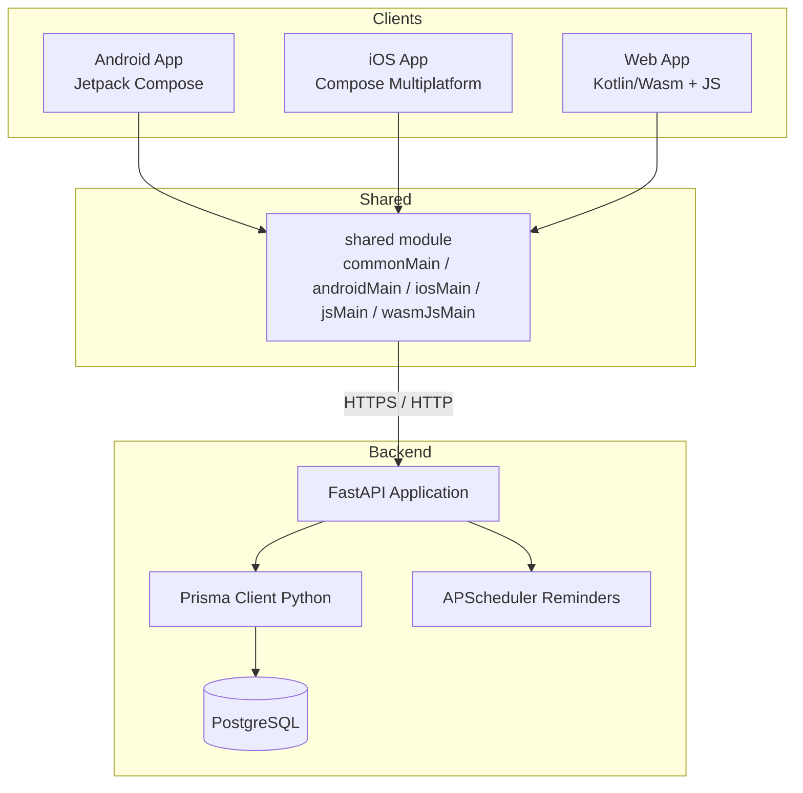
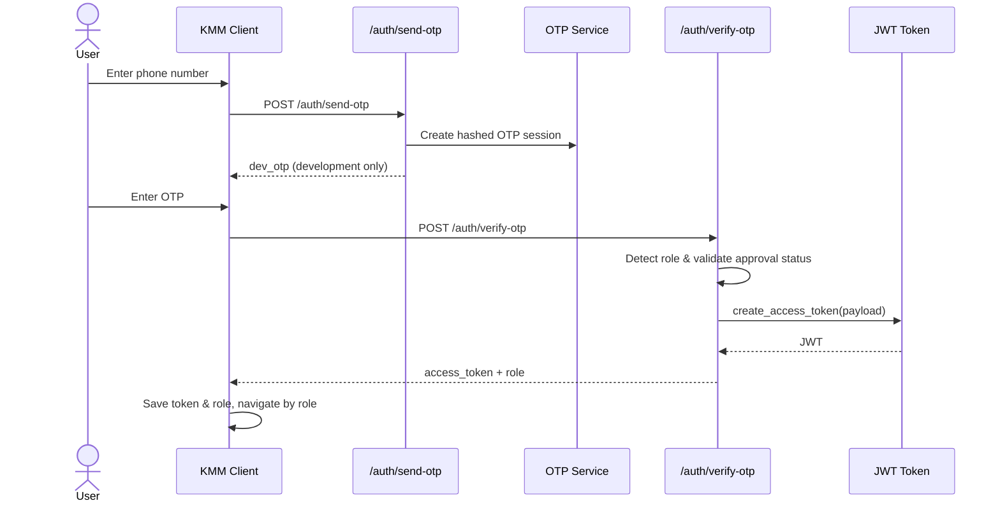
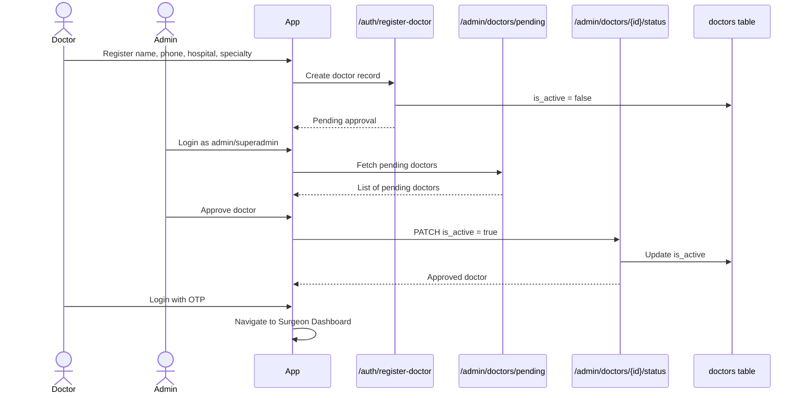
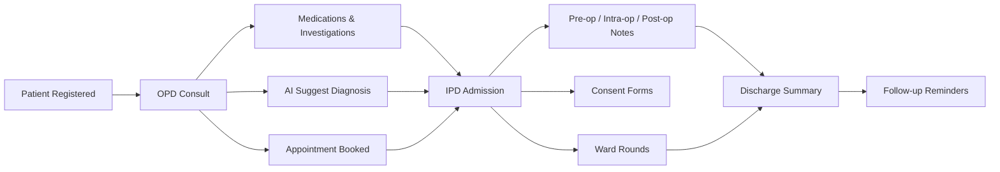

# Nori Tura — Surgical Care Platform

A Kotlin Multiplatform Mobile (KMM) + FastAPI platform for pediatric surgical care coordination. It connects surgeons, nurses, clinic admins, and parents through a shared patient record system with OPD visits, IPD admissions, surgical templates, AI-assisted diagnosis suggestions, consent forms, and follow-up reminders.

> **Status:** Active development. Core backend and shared KMM UI are functional; some external integrations (WhatsApp Cloud API, SMS OTP, FCM) are stubbed until credentials are configured.

---

## Table of Contents

- [Overview](#overview)
- [Tech Stack](#tech-stack)
- [Architecture](#architecture)
- [Project Structure](#project-structure)
- [Authentication & Roles](#authentication--roles)
- [Doctor Approval Workflow](#doctor-approval-workflow)
- [Patient Care Flow](#patient-care-flow)
- [Getting Started](#getting-started)
  - [Backend](#backend)
  - [Android](#android)
  - [iOS](#ios)
  - [Web](#web)
- [Environment Variables](#environment-variables)
- [API Overview](#api-overview)
- [Roles & Permissions](#roles--permissions)
- [Known Limitations](#known-limitations)
- [License](#license)

---

## Overview

Nori Tura is built around the idea that surgical patient care spans multiple roles and touch-points:

- **Surgeons** manage patients, OPD records, IPD admissions, surgical templates, nurses, and consent forms.
- **Nurses** assist with patient intake, appointments, admissions, ward rounds, and post-op notes.
- **Clinic Admins / Superadmins** approve newly registered surgeons and manage staff access.
- **Parents** view their children's records and book follow-up appointments.

The mobile and web clients share a single Compose Multiplatform UI written in Kotlin, while the backend is a FastAPI service backed by PostgreSQL and Prisma.

---

## Tech Stack

| Layer | Technology |
|-------|------------|
| Mobile / Web UI | Kotlin 2.0.21, Compose Multiplatform 1.7.0, navigation-compose |
| Networking | Ktor 3.0.0, kotlinx-serialization-json |
| State & Storage | ViewModel, kotlinx.coroutines, multiplatform-settings |
| Backend | FastAPI 0.111.0, Python 3.11, Prisma Client Python 0.13.1 |
| Database | PostgreSQL 16 |
| Auth | JWT (PyJWT), SHA-256 hashed OTP sessions |
| AI Diagnosis | OpenAI / Anthropic with structured fallback |
| Consent PDF | WeasyPrint with HTML fallback |
| Reminders | APScheduler cron job |

---

## Architecture



---

## Project Structure

```text
Noritura/
├── androidApp/          # Android application entry point
├── iosApp/              # Xcode project and iOS entry point
├── webApp/              # Kotlin/JS and Kotlin/Wasm browser entry points
├── shared/              # Shared KMM business logic, UI, and repositories
│   ├── src/commonMain/  # Shared Compose UI, ViewModels, DTOs, repositories
│   ├── src/androidMain/ # Android-specific platform implementations
│   ├── src/iosMain/     # iOS-specific platform implementations
│   ├── src/jsMain/      # JS-specific platform implementations
│   └── src/wasmJsMain/  # Wasm-specific platform implementations
├── backend/             # FastAPI backend
│   ├── app/             # Routers, services, core dependencies
│   ├── prisma/          # Schema (generated client excluded from VCS)
│   ├── scripts/         # Seed scripts
│   └── docker-compose.yml
├── gradle/              # Version catalog and wrapper
└── README.md
```

---

## Authentication & Roles

Login is OTP-based. The backend detects the role from the phone number in this order:

1. Admin / Superadmin
2. Approved Doctor → Surgeon
3. Active Nurse → Nurse
4. Existing Patient Parent → Parent



---

## Doctor Approval Workflow

New surgeons self-register. Their account is inactive until an admin or superadmin approves them.



---

## Patient Care Flow



---

## Getting Started

### Prerequisites

- JDK 17
- Android Studio Ladybug (2024.2.1) or newer
- Android SDK API 34 + NDK 27.2.12479018
- Python 3.11
- Docker & Docker Compose
- Xcode 15+ (for iOS)

See [`sdk-versions.txt`](./sdk-versions.txt) for the exact Android SDK components.

### Backend

```bash
cd backend
python3.11 -m venv .venv
source .venv/bin/activate
pip install -r requirements.txt

# Start PostgreSQL
docker compose up -d

# Copy and configure environment variables
cp .env.example .env

# Generate Prisma client and push schema
prisma generate
prisma db push

# Seed the default superadmin
python scripts/seed_superadmin.py

# Run the development server
uvicorn app.main:app --reload
```

Default superadmin: `+919999999999` (OTP is printed to the backend terminal in development mode).

### Android

```bash
./gradlew :androidApp:assembleDebug
# Or install directly on a connected device / emulator:
./gradlew :androidApp:installDebug
```

Use `10.0.2.2:8000` as the backend URL when running on the Android Emulator.

### iOS

Open `iosApp/iosApp.xcodeproj` in Xcode. The run script expects `JAVA_HOME` to point to a JDK installation (e.g., `/opt/homebrew/opt/openjdk`).

### Web

```bash
# Wasm target (faster, modern browsers)
./gradlew :webApp:wasmJsBrowserDevelopmentRun

# JS target (broader browser support)
./gradlew :webApp:jsBrowserDevelopmentRun
```

---

## Environment Variables

Copy `backend/.env.example` to `backend/.env` and fill in the values:

| Variable | Purpose |
|----------|---------|
| `DATABASE_URL` | PostgreSQL connection string |
| `JWT_SECRET` | Secret for signing JWT tokens |
| `JWT_ALGORITHM` | JWT algorithm (default `HS256`) |
| `JWT_EXPIRATION_HOURS` | Token lifetime (default `720`) |
| `OTP_EXPIRY_MINUTES` | OTP validity window |
| `OPENAI_API_KEY` / `ANTHROPIC_API_KEY` | LLM providers for AI diagnosis |
| `META_WA_TOKEN` / `META_WA_PHONE_ID` | WhatsApp Cloud API |
| `TWOFACTOR_API_KEY` / `MSG91_AUTH_KEY` | SMS OTP providers |
| `CLOUDINARY_URL` | Cloudinary image/document uploads |
| `FIREBASE_CREDENTIALS_JSON` | FCM server credentials |

---

## API Overview

| Prefix | Description |
|--------|-------------|
| `/auth` | OTP send/verify, doctor registration, FCM token registration |
| `/admin` | Doctor approvals, admin management (admin/superadmin only) |
| `/patients` | Patient CRUD with doctor-pool isolation |
| `/opd` | OPD records, medications, investigations |
| `/appointments` | Appointment booking and status updates |
| `/ipd` | Admissions, pre-op / intra-op / post-op notes, ward rounds, discharge |
| `/nurses` | Nurse management |
| `/ai` | AI suggestive diagnosis with audit logging |
| `/consent` | MCI/NABH consent form generation and digital signing |
| `/documents` | Document record tracking |

---

## Roles & Permissions

| Role | Capabilities |
|------|--------------|
| **Superadmin** | Approve doctors, create admins, full staff access |
| **Admin** | Approve doctors, view pending registrations |
| **Surgeon** | Full CRUD within their doctor pool: patients, OPD, IPD, nurses, templates, consent |
| **Nurse** | Add patients, OPD records, appointments, admissions (urgency), ward rounds, post-op notes |
| **Patient Parent** | View own children's records and book appointments |

---

## Known Limitations

- **External integrations** (WhatsApp Cloud API, 2Factor.in/MSG91 SMS, FCM/APNs, Cloudinary, OpenAI/Anthropic) are stubbed or require credentials.
- **Consent PDF generation** uses WeasyPrint; on systems without Pango/GTK+ libraries it falls back to HTML.
- **Parent UI** is currently a placeholder home screen.
- **Appointments screen** is a placeholder.
- **Wasm DateProvider** uses UTC; Android/iOS/JS use the local timezone.

---

## License

This project is proprietary and confidential. All rights reserved.
